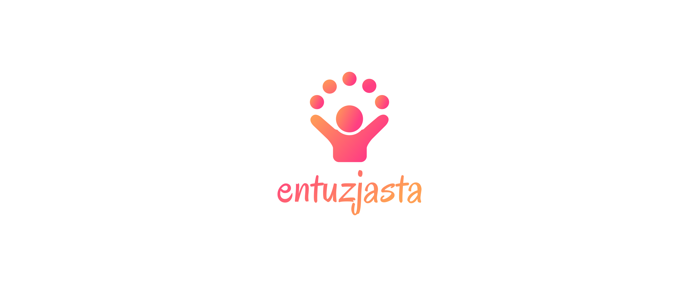
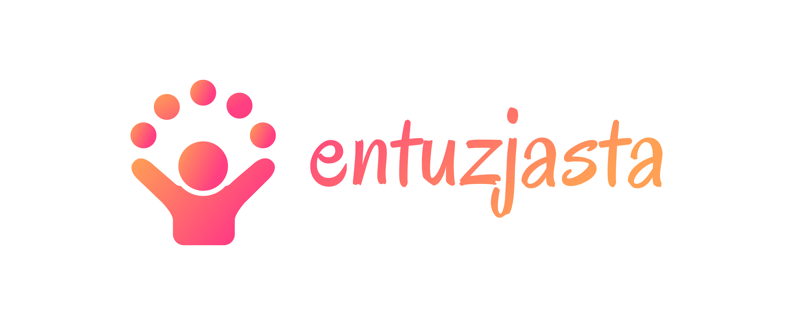
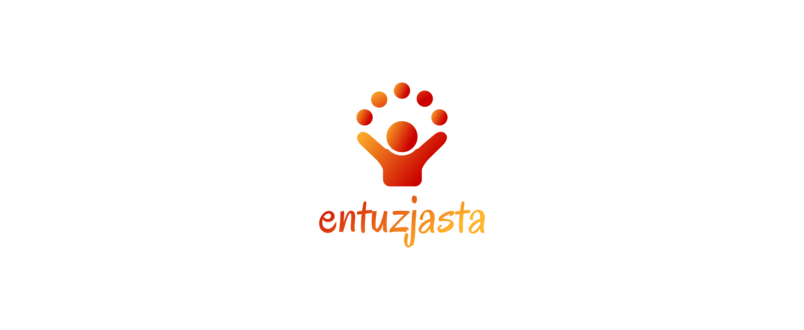
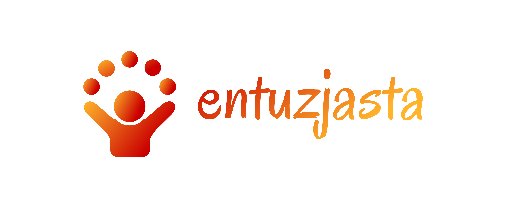

# logo
Logotyp:  Entuzjasta . pl

Concept of logo

## Font
+ Astigmatic

Font in use <a target="_blank" href="https://fonts.google.com/specimen/Oregano">Oregano-Regular</a> designed by
        <a target="_blank" href="http://www.astigmatic.com/">Astigmatic</a>
        and licensed under
        <a target="_blank" href="http://scripts.sil.org/cms/scripts/page.php?site_id=nrsi&amp;id=OFL_web">Open Font License.</a>

## Icon Designed by

+ priyanka
https://thenounproject.com/creativepriyanka

## Colors

### icon
   
  + red, #FF3F82
  + orange, #FFA055

### background

  + white
  + #ffffff
  
### font
  
  + orange, #FFA055
  + red, #FF3F82

### css 
    p {
       font-family: 'Astigmatic';
       font-weight: normal;
       font-style: normal;
    }

### html

    <link rel="stylesheet" media="screen" href="https://fontlibrary.org/face/Astigmatic" type="text/css"/>
    
    
# Logo

## 1

## 2

## 3

## 4

